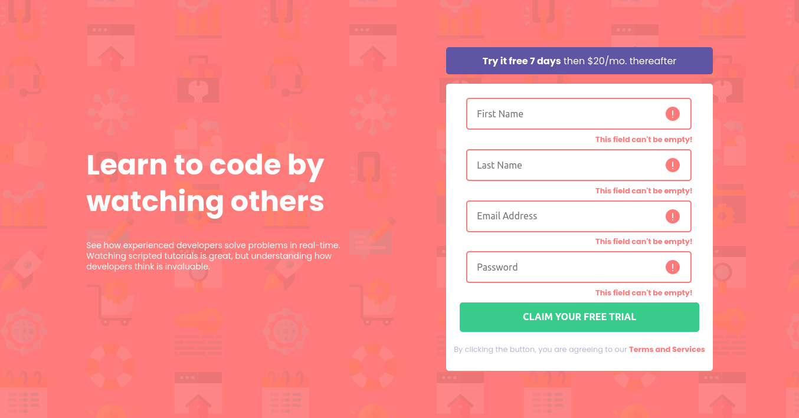

# Frontend Mentor - Intro component with sign up form solution

This is a solution to the [Intro component with sign up form challenge on Frontend Mentor](https://www.frontendmentor.io/challenges/intro-component-with-signup-form-5cf91bd49edda32581d28fd1). Frontend Mentor challenges help you improve your coding skills by building realistic projects.

## Table of contents

- [Overview](#overview)
  - [The challenge](#the-challenge)
  - [Screenshot](#screenshot)
  - [Links](#links)
- [My process](#my-process)
  - [Built with](#built-with)
  - [What I learned](#what-i-learned)
  - [Continued development](#continued-development)
  - [Useful resources](#useful-resources)
- [Author](#author)

**Note: Delete this note and update the table of contents based on what sections you keep.**

## Overview

### The challenge

Users should be able to:

- View the optimal layout for the site depending on their device's screen size
- See hover states for all interactive elements on the page
- Receive an error message when the `form` is submitted if:
  - Any `input` field is empty. The message for this error should say _"[Field Name] cannot be empty"_
  - The email address is not formatted correctly (i.e. a correct email address should have this structure: `name@host.tld`). The message for this error should say _"Looks like this is not an email"_

### Screenshot



### Links

- Solution URL: [Solution URL here](https://github.com/mahoutin2004/sign-up-form)
- Live Site URL: [Live site URL here](https://mahoutin2004.github.io/sign-up-form/)

## My process

### Built with

- Semantic HTML5 markup
- CSS custom properties
- Flexbox
- Mobile-first workflow

### What I learned

DOM manipulation

```js
function myFunction(item, index, arr) {
  submit.addEventListener("click", function (e) {
    if (arr[index].id !== "submit" && arr[index].value == "") {
      arr[index].classList.add("input-error");

      const errorDiv = document.createElement("div");
      errorDiv.innerHTML = "This field can't be empty!";
      errorDiv.setAttribute(
        "style",
        "color: hsl(0, 100%, 74%); text-align: right; font-size: 0.8em; font-weight: 700;"
      );
      arr[index].parentNode.appendChild(errorDiv);
    }
  });

  arr[index].addEventListener("focus", function (e) {
    arr[index].classList.remove("input-error");

    if (arr[index].parentNode.lastChild.tagName === "DIV") {
      arr[index].parentNode.removeChild(arr[index].parentNode.lastChild);
    }
  });
}
```

### Continued development

In future project, I want to focus on regex, code logic and optimisation, animations, UI and UX.

### Useful resources

- [W3Schools](https://www.w3schools.com/js/js_htmldom.asp)

## Author

- Twitter - [@AhoumenouO](https://www.twitter.com/AhoumenouO)
- Github - [mahoutin2004](https://github.com/mahoutin2004)
